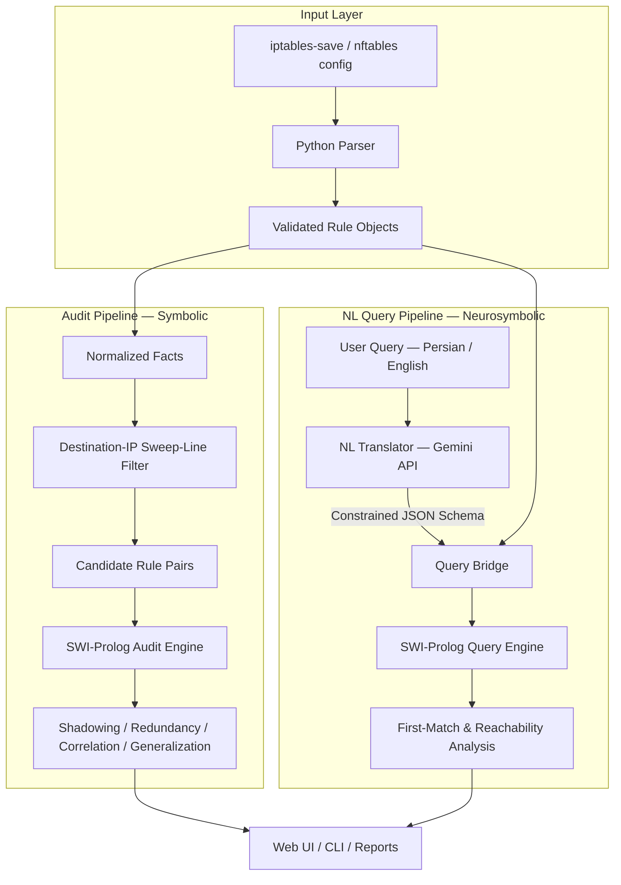

# FirewallLogic

### Automated Firewall Policy Auditing & Neurosymbolic Query Engine

<p align="center">
  
  
  
  
  
  
</p>

<p align="center">
  <b>Hybrid Python–Prolog system for explainable firewall policy auditing, anomaly detection, and natural-language security reasoning.</b>
</p>

---

## Table of Contents

* [Abstract](#abstract)
* [Research Motivation & Neurosymbolic Architecture](#research-motivation--neurosymbolic-architecture)
* [System Architecture](#system-architecture)
* [Natural Language Querying (Logic-LM Pattern)](#natural-language-querying-logic-lm-pattern)
* [Sweep-Line Optimization](#sweep-line-optimization)
* [Symbolic Anomaly Detection](#symbolic-anomaly-detection)
* [Supported Analysis Features](#supported-analysis-features)
* [Repository Structure](#repository-structure)
* [Installation & Setup](#installation--setup)
* [Screenshots & Experimental Outputs](#screenshots--experimental-outputs)
* [Limitations](#limitations)


---

## Abstract

**FirewallLogic** is a hybrid **Neurosymbolic Python–Prolog system** designed for automated firewall policy auditing, anomaly detection, and natural-language policy querying.

The system operates on two core pillars:

### 1. Symbolic Anomaly Audit Engine

Detects four structural policy anomalies:

* **Shadowing**
* **Redundancy**
* **Correlation**
* **Generalization**

The audit pipeline combines a 1D destination-IP **Sweep-Line optimization algorithm** for candidate filtering with a **SWI-Prolog deduction engine** for formal semantic verification.

### 2. Neurosymbolic Natural Language Query Interface

FirewallLogic follows a **Logic-LM-inspired pattern** in which free-form Persian or English queries are translated into structured logical predicates using an LLM.

The resulting predicates are then executed deterministically by Prolog, enabling **provable first-match reasoning** instead of allowing the LLM to directly generate security decisions.

This architecture helps reduce hallucination risks by separating:

> **Natural-language interpretation** from **formal security reasoning**.

---

## Research Motivation & Neurosymbolic Architecture

Network security policies require **provable correctness**.

Standard Large Language Models (LLMs) can interpret natural language effectively, but they are not inherently reliable for deterministic reasoning over complex firewall policies and may produce hallucinated or unprovable answers.

Formal logic engines such as **Prolog**, on the other hand, provide precise symbolic reasoning but cannot naturally interpret ambiguous human-language intents.

FirewallLogic addresses this trade-off through a **Modular Neurosymbolic Architecture** inspired by the Logic-LM pattern.

```text
┌──────────────────────────┐
│ Natural Language Input   │
│   Persian / English      │
└────────────┬─────────────┘
             │
             ▼
┌──────────────────────────┐
│     LLM / Gemini         │
│      Neural Layer        │
└────────────┬─────────────┘
             │
             │ Typed JSON Predicate
             ▼
┌──────────────────────────┐
│    Query Bridge          │
│  Schema Validation       │
└────────────┬─────────────┘
             │
             ▼
┌──────────────────────────┐
│     SWI-Prolog           │
│     Symbolic Layer       │
└────────────┬─────────────┘
             │
             ▼
┌──────────────────────────┐
│    Provable Answer       │
└──────────────────────────┘
```

### Neural Layer

The **Gemini API** performs semantic parsing and maps unconstrained Persian/English queries into a strictly typed, closed schema of logical functions, such as:

* `is_allowed`
* `reachable_from`
* `who_can_reach`
* `rules_matching_ip`

### Symbolic Layer

The **SWI-Prolog engine** performs:

* Exact first-match evaluation
* Subnet interval arithmetic
* Rule priority analysis
* Formal policy reasoning

The LLM does **not** directly generate firewall decisions. It only translates the user's intent into a structured query that is subsequently evaluated by the symbolic reasoning engine.

---

## System Architecture

FirewallLogic contains two complementary pipelines:

1. **Static anomaly auditing**
2. **Neurosymbolic natural-language querying**



---

## Natural Language Querying (Logic-LM Pattern)

FirewallLogic exposes a `/query` endpoint capable of answering non-trivial firewall policy questions.

### Example Queries

**English:**

> Can `10.10.25.5` access `192.168.50.10` on port `22`?

**Persian:**

> آیا سیستم `10.10.25.5` به سرور `192.168.50.10` دسترسی دارد؟

**Rule inspection:**

> Which rules match destination IP `192.168.50.10`?

---

### Security Design: Server-Side Schema Enforcement

Instead of asking the LLM to emit raw executable Prolog code—which could introduce injection and syntax risks—the translator (`nl_translator.py`) forces the LLM to output a **Pydantic-validated JSON structure** using Gemini's server-side `response_schema`.

This creates a controlled boundary between the neural and symbolic components.

### Supported Query Functions

| Function                                            | Description                                                                     |
| --------------------------------------------------- | ------------------------------------------------------------------------------- |
| `is_allowed(chain, src_ip, dst_ip, protocol, port)` | Computes the exact first-match decision: `allow`, `deny`, or `default_deny`.    |
| `reachable_from(chain, src_ip)`                     | Lists candidate destination subnets accessible from a source.                   |
| `who_can_reach(chain, dst_ip)`                      | Identifies source subnets permitted to reach a destination.                     |
| `rules_matching_ip(chain, ip, direction)`           | Retrieves matching rules sorted by priority to explain why a decision was made. |

---

## Sweep-Line Optimization

### Naïve Pairwise Comparison

A naïve implementation that compares every pair of `N` firewall rules requires:

$$
\mathcal{O}(N^2)
$$

This quickly becomes expensive as the number of firewall rules increases.

### Sweep-Line Candidate Generation

FirewallLogic converts destination IP ranges into **1D integer intervals**.

The intervals are:

1. Converted from CIDR ranges into numerical intervals.
2. Sorted by their start positions.
3. Processed using a sweep-line algorithm.
4. Filtered to eliminate non-overlapping rule pairs.
5. Passed to Prolog only when semantic analysis is potentially necessary.

The resulting complexity is approximately:

```text
Sorting:          O(N log N)
Candidate pairs:  O(M)

Overall:          O(N log N + M)
```

Where `M` represents the number of overlapping candidate pairs.

In typical rule bases:

$$
M \ll N^2
$$

Therefore, the sweep-line stage can significantly reduce the number of rule pairs that require symbolic reasoning.

---

## Symbolic Anomaly Detection

FirewallLogic evaluates structural firewall-rule anomalies using Prolog predicates.

### Shadowing

A higher-priority rule completely covers a lower-priority rule, rendering the lower-priority rule unreachable.

### Redundancy

A rule provides no additional access because an earlier rule already performs an equivalent action.

### Correlation

Two rules overlap in traffic space but specify conflicting actions, producing order-dependent behavior.

### Generalization

A lower-priority rule covers a broader traffic space than a preceding, more specific rule.

---

## Supported Analysis Features

* `iptables-save` syntax support
* `nftables` syntax support
* IPv4 address and CIDR subnet range arithmetic
* Natural Language Interface through `/query`
* Persian and English natural-language queries
* Automatic Gemini API key failover
* First-match firewall policy simulation
* Incremental audit mode — **Check New Rules**
* Full policy anomaly reporting
* Severity-based result cards
* Persian **RTL** Web UI
* English **LTR** Web UI

---

## Repository Structure

```text
FirewallLogic/
│
├── ip_subnet.pl                 # Prolog: IP/CIDR interval arithmetic
├── firewall_engine.pl           # Prolog: Core symbolic anomaly audit rules
├── query_engine.pl              # Prolog: Natural-language query reasoning engine
│
├── parser.py                    # Python: Firewall configuration parser
├── bridge.py                    # Python: PySwip interface for anomaly auditing
├── incremental.py               # Python: Incremental rule-set analyzer
├── webapp.py                    # Python: Flask web server & UI routing
├── audit_log.py                 # Python: Execution logging & telemetry
│
├── nl_query/
│   ├── query_bridge.py          # Python: Prolog bridge for NL query engine
│   └── nl_translator.py         # Python: Gemini API + Pydantic schema
│
├── test_configs/                # Real-world and test firewall configurations
├── templates/                   # HTML templates
├── static/                      # CSS & Web assets
├── images/                      # Documentation screenshots
│
├── .env.example                 # Example environment configuration
└── requirements.txt             # Python dependencies
```

---

## Installation & Setup

### Requirements

* **Python:** 3.8+
* **SWI-Prolog:** 8.0+

Install SWI-Prolog using your operating system's package manager.

For example:

```bash
# Ubuntu / Debian
sudo apt install swi-prolog

# macOS
brew install swi-prolog
```

### Quick Start

#### 1. Clone the Repository

```bash
git clone https://github.com/your-username/firewalllogic.git
cd firewalllogic
```

#### 2. Create a Virtual Environment

```bash
python3 -m venv .venv
source .venv/bin/activate
```

On Windows:

```powershell
.venv\Scripts\activate
```

#### 3. Install Python Dependencies

```bash
pip install -r requirements.txt
```

#### 4. Configure Gemini API Key

The Gemini API is optional and is primarily required for the `/query` natural-language interface.

```bash
cp .env.example .env
```

Then configure:

```env
GEMINI_API_KEY=your_api_key
```

#### 5. Launch the Web Application

```bash
python webapp.py
```

The application will be available at:

```text
http://localhost:5000
```

---

## Screenshots & Experimental Outputs

Documentation screenshots and experimental outputs are stored in the [`images/`](./images/) directory.

### 1. Main Page

The primary FirewallLogic auditing interface.

### 2. Natural Language Query Interface

The `/query` interface allows users to submit Persian or English questions and translate them into structured logical queries.

### 3. Incremental "Check New Rules" Page

The incremental auditing interface analyzes newly introduced firewall rules against an existing rule set.

### 4. Result Report

The audit interface presents detected anomalies using structured reports and severity indicators.

---


## Limitations

### 1. Sweep-Line Dimensionality

Candidate filtering currently indexes destination IP ranges.

Multi-dimensional indexing across:

* IP
* Port
* Protocol

is not currently implemented and remains an area for further development.

### 2. Stateless Verification

The current system focuses on static firewall rule sets.

Dynamic connection-tracking mechanisms such as `conntrack` state tables are not evaluated.

### 3. Process-Local Logging

Audit logging currently relies on local storage through:

```text
audit_log.csv
```

---


## Project Philosophy

FirewallLogic is built around a simple principle:

> **Let neural models interpret intent; let symbolic systems prove the answer.**

The neural component provides the flexibility required to understand human language, while the symbolic component provides deterministic and explainable reasoning over firewall policies.

This separation creates a practical architecture for combining **Generative AI with formal logic** in security-sensitive applications.
